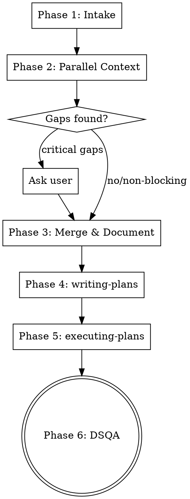

# implement-design

Take a Figma design and a component (existing or new) and implement it fully — from understanding the current state to verifying the final result with DSQA.

Do NOT skip any phase. Do NOT start implementing before completing the context-gathering phases.

## Process Flow



---

## Phase 1 — Intake (Interactive)

Ask these questions **one at a time**. Wait for each answer before asking the next.

1. "Qual o nome do componente?"
2. "Qual a URL do Figma para a versao **desktop**?" (required — keep asking if not provided)
3. "Existe uma versao **mobile** no Figma? Se sim, qual a URL?"
4. "Qual a URL no localhost para visualizar esse componente?"
5. "Esse componente ja existe no projeto? (sim / nao / nao sei)"
   - If **nao**: also ask target directory

Extract `fileKey` and `nodeId` from Figma URLs:
- `figma.com/design/<fileKey>/...?node-id=<nodeId>`
- URL-decode `nodeId`: replace `%3A` with `:`, replace `-` with `:`

---

## Phase 1.5 — Load Relevant Lessons (optional but recommended)

If `docs/lessons/` exists, load lessons relevant to frontend implementation:

```bash
bash bin/skill-scripts/review/lessons-loader.sh --category frontend --content
bash bin/skill-scripts/review/lessons-loader.sh --category code-patterns --content
```

Use these as guardrails during implementation — avoid repeating past mistakes.

---

## Phase 2 — Parallel Context Gathering

Dispatch two subagents simultaneously using the Agent tool.

### Subagent A — Figma Extractor

Tasks:
1. `get_design_context(fileKey, nodeId)` for desktop (+ mobile if provided)
2. `get_screenshot(fileKey, nodeId)` for desktop (+ mobile if provided)
3. Extract ALL values: fills, strokes, cornerRadius, padding, gap, typography per text node, effects
4. List every child element (buttons, links, icons, text nodes, images)
5. Compare JSON output against screenshot — note "visual gaps"
6. Mark buttons/links without URL as "URL: a definir"

### Subagent B — Codebase Explorer

Tasks:
1. Search codebase for the component (Grep + Glob in `src/components/`, `src/app/`)
2. Read main component file + imported sub-components (up to 2 levels)
3. Map: props, state, data sources, hardcoded text
4. Navigate to localhost URL via Playwright, take screenshot
5. Return structured report

Wait for BOTH subagents before proceeding.

---

## Phase 3 — Merge, Validate, Document

### Critical Gaps (BLOCK — ask user before continuing)
- Interactive button/link with no URL in Figma
- Unidentifiable font family
- Asset visible in screenshot but not in project

### Non-blocking Gaps (annotate and continue)
- Color deviation <10% → use nearest design system token
- Spacing mismatch → use nearest token
- Mobile Figma not provided → proceed desktop only

### Save Context Document

Save to `docs/plans/YYYY-MM-DD-implement-<component-name>.md` with: Figma specs (layout, colors, typography, spacing, element inventory, visual gaps), current implementation details (files, props, state, data sources), and gap analysis (what changes, what stays, reusable components, new files needed).

### Update STATIC_CONTENT_TRACKER.md

If hardcoded text strings were found, add entries for any not already tracked.

---

## Phase 4 — Invoke writing-plans

Pass the context document as input to the `/superpowers:writing-plans` skill to produce a step-by-step implementation plan. If the Superpowers plugin is not installed, create the implementation plan inline following the context document.

## Phase 5 — Invoke executing-plans

Pass the implementation plan to the `/superpowers:executing-plans` skill. If the Superpowers plugin is not installed, execute the plan steps sequentially.

## Phase 6 — Automatic DSQA

After the implementation is complete, invoke `/dtk:dsqa` with:
- Figma desktop URL from intake
- Localhost URL from intake
- Component name as `data-dsqa` selector (kebab-case)

## When NOT to Use

- Pure logic/backend changes with no visual component
- CSS-only tweaks where the design is already implemented (use dsqa directly to verify)
- Prototyping or exploration without a Figma reference

## Rules

- **Never start implementing before Phase 3 is complete.** Context first, code second.
- **One question at a time** in Phase 1.
- **Never guess** file locations — search the codebase explicitly.
- **Always take screenshots** — from Figma and from the browser.
- **Trust the DSQA** — it is the final authority on design fidelity.
